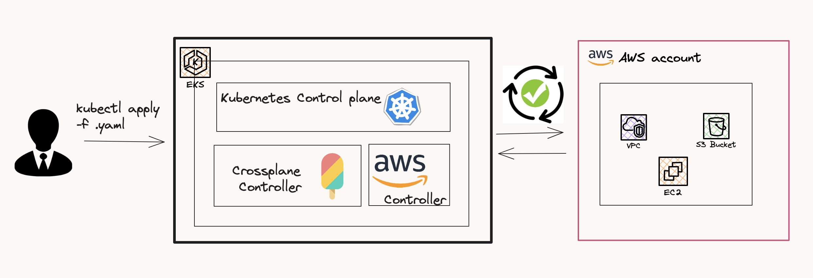

# ### Crossplane Provides

# AWS 

https://marketplace.upbound.io/providers?query=AWS


learn how Crossplane enables platform teams to manage their infrastructure and managed services on cloud providers like AWS. Sai Vennam outlines how you can use Crossplane to deploy and manage a production-ready Amazon EKS cluster.


# 🚀 Purpose

## Build-aws-platform-using-crossplane


**Step 1:** Install Crossplane
Add and install the Crossplane repository using the following Helm commands:

```
helm repo add crossplane-stable https://charts.crossplane.io/stable
helm install crossplane --namespace crossplane-system --create-namespace --version 1.14.5 crossplane-stable/crossplane
```

You can also customize the crossplane helm chart: [https://docs.crossplane.io/latest/software/install/#customize-the-crossplane-helm-chart]

**Step 2:** Provide IAM Keys
Specify the file path containing AWS access and secret keys:

```
[default]
aws_access_key_id = AKIAW
aws_secret_access_key = 1sPsc8HUWtY3x
```

**Step 3:** Create Kubernetes Secret
Create a Kubernetes secret containing AWS credentials:

```
kubectl create secret generic aws-secret -n crossplane-system --from-file=creds=./aws-credentials.txt
```

**Step4:** Create S3 Provider to create the bucket

```
apiVersion: pkg.crossplane.io/v1
kind: Provider
metadata:
  name: provider-aws-s3
spec:
  package: xpkg.upbound.io/upbound/provider-aws-s3:v0.47.1
```

**Step6:** Create Ec2 provider to create the VPC and EC2

```
apiVersion: pkg.crossplane.io/v1
kind: Provider
metadata:
  name: provider-aws-ec2
spec:
  package: xpkg.upbound.io/upbound/provider-aws-ec2:v0.47.1
```

**Step5:**  Create ProviderConfig

```
apiVersion: aws.upbound.io/v1beta1
kind: ProviderConfig
metadata:
  name: default
spec:
  credentials:
    source: Secret
    secretRef:
      namespace: crossplane-system
      name: aws-secret
      key: creds
```

**Step6:** Create Resources
Create S3 using the respective YAML files:

```
kubectl apply -f s3.yaml
```

**Step7:** Create Resources
Create vpc using the respective YAML files:

```
kubectl apply -f vpc.yaml
```

**Step8:** Create Resources
Create ec2 using the respective YAML files:

```
kubectl apply -f ec2.yaml
```
